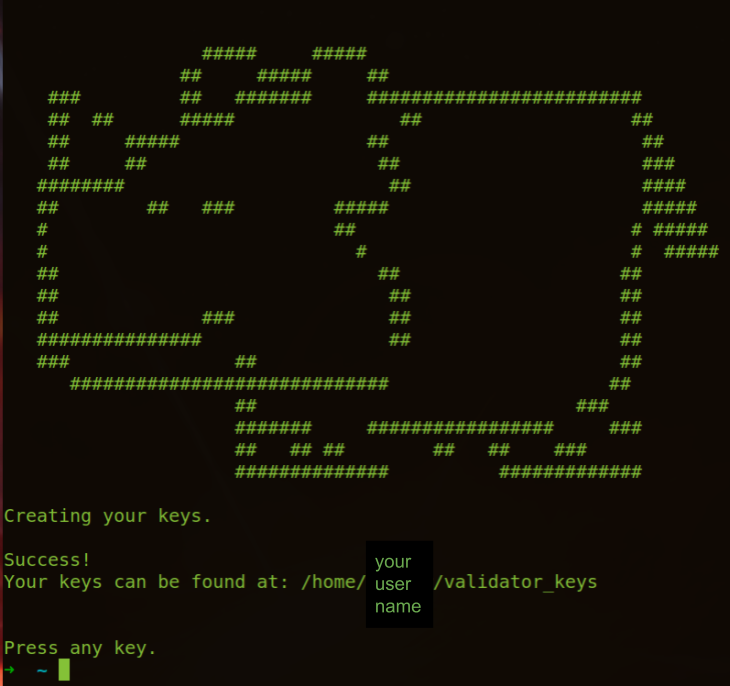
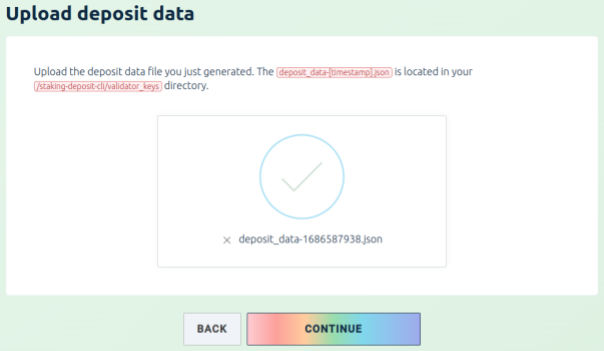
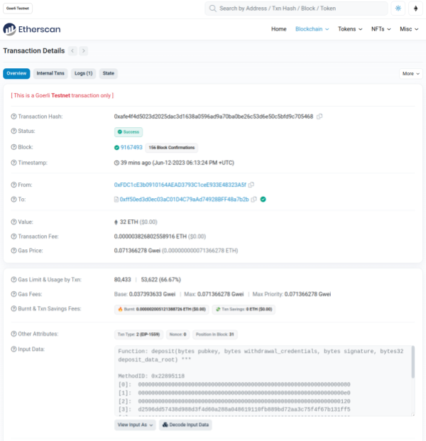

# How to Create an Ethereum Staking Validator

Author: Pieter Greyling (Sunday 2023.07.23)

----------

## Overview

This is a step-by-step guide on how to create an Ethereum staking validator using Ethereum's official Staking Deposit CLI.

## Important Notes and Risks

This guide will use the **Ubuntu Linux Desktop OS (22.04.2 LTS)** as the local development and runtime platform for the validator.

**Do Not** deploy/connect your validator to any Production/Mainnet blockchain! We will be using a Testnet.

**Do Not** deploy your validator to any Distributed Validator Technology (DVT/SSV) platform!

Staking ETH on a Testnet is a good way to test out Ethereum staking without using real ETH. It is also a way to learn about the Ethereum staking process and earn rewards for your participation.

There are some risks associated with staking ETH on a Testnet.

- Slashing:

  - If you are penalized for misbehavior, such as downtime or slashing attacks, you may lose some or all of your staked ETH.

- Impermanent loss:  

  - If the price of ETH falls below the price at which you staked it, you may lose some of your staked ETH.

### What is an Ethereum Staking Validator?

Ethereum uses Proof-of-Stake (PoS) consensus, where validators explicitly stake capital in the form of ETH into a smart contract on Ethereum. This staked ETH then acts as collateral that can be destroyed if the validator behaves dishonestly or lazily. The validator is then responsible for checking that new blocks propagated over the network are valid and occasionally creating and propagating new blocks themselves.

To participate as a validator, a user must deposit 32 ETH into the deposit contract and run three separate pieces of software:

- an execution client
- a consensus client
- a validator

On depositing their ETH, the user joins an activation queue that limits the rate of new validators joining the network. Once activated, validators receive new blocks from peers on the Ethereum network. The transactions delivered in the block are re-executed, and the block signature is checked to ensure the block is valid. The validator then sends a vote (called an attestation) in favor of that block across the network.

### The Role of the Beacon Chain

The Beacon Chain is a peer-to-peer network of consensus clients that handles block gossip and consensus logic, while the original clients form the transaction execution layer and manage Ethereum's state. The two layers can communicate with one another using the Engine API.

An Ethereum 2 staking validator requires a Beacon Chain (even when it runs on a Testnet). The Beacon Chain is the core component of Ethereum 2 POS and is responsible for coordinating the network of validators, assigning them blocks to produce, and ensuring that the network remains secure. Without a Beacon Chain, it would not be possible to run a staking validator on any Ethereum 2 network, including Testnets.

A Beacon Chain is required for Ethereum 2 staking for the following reasons:

- The Beacon Chain is responsible for assigning blocks to validators. This is done through a process called slot leader selection, which is based on the amount of ETH that each validator has staked.
- It ensures that the network remains secure. This is done by slashing validators who misbehave, such as by failing to produce blocks or attestations on time.
- The Beacon Chain coordinates the network of validators. This includes tasks such as relaying messages between validators and ensuring that all validators are synchronized with the latest state of the network.

Without a Beacon Chain, it would not be possible to run a staking validator on any Ethereum 2 network, including Testnets. This is because the Beacon Chain is responsible for many of the core functions that are required for staking, such as block assignment, security, and coordination.

### Ethereum Validator Component Interactions

The following sequence diagram shows what is involved when an Ethereum Staking Validator node interacts with the Beacon Chain.

The Ethereum Staking Validator Node is a software program that runs on a computer and connects to the Beacon Chain. It is responsible for validating blocks and submitting them to the Beacon Chain. The Beacon Chain is a decentralized network of computers that maintains the Ethereum blockchain.

Geth (Client) is a full node Ethereum client that can be used to interact with the Ethereum network. It is used by the Ethereum Staking Validator Node to report block information and validate blocks.

The Ethereum Staking Validator Node earns rewards for validating blocks. These rewards are paid out in ETH.


### Local Validator, Testnet, and Beacon Chain Interactions

The following are the components involved in the interaction between a local development Ethereum 2 stake validator and an Ethereum Testnet:

- Local Development Ethereum 2 Stake Validator: This is a software application that runs on your computer and allows you to participate in the Ethereum 2.0 proof-of-stake consensus mechanism.
- Ethereum Testnet: A separate blockchain network that is used for testing and development - purposes. It is not connected to the Ethereum Mainnet and has its own set of rules and parameters.
- Ethereum JSON-RPC API: The set of Application Programming Interface (API) endpoints that allow you to interact with the Ethereum blockchain network.
- Ethereum p2p protocol: A networking protocol that allows Ethereum nodes to communicate with each other.


## Setup: Local Validator, Testnet, and Beacon Chain Setup Workflow

This sequence diagram shows the steps involved in setting up a local development Ethereum 2 stake validator and connecting it to an Ethereum 2 Testnet and the Testnet Beacon Chain.


## Setup: Prerequisites

### The baseline hardware recommendations to run an Ethereum staking validator

- CPU: A quad-core processor with at least 2GHz clock speed.
- RAM: 16GB.
- Storage: At least 1TB of storage. A solid-state drive (SSD) will provide faster storage speeds than a traditional hard drive.
- Internet connection: A reliable internet connection with at least 25 MBit/s bandwidth.
- Operating system:
  - Ubuntu 20.04 or later is the recommended operating system for running an Ethereum staking validator.
  - Mac OS X 10.14+ or Windows 10+ 64-bit can also be used for testing purposes.

Recommended reading:

- Goerli Testnet Staking Launchpad Validator Checklist
  - <https://goerli.launchpad.ethereum.org/en/checklist>
- Goerli Testnet Staking Launchpad Validator FAQs
  - <https://goerli.launchpad.ethereum.org/en/faq>
- Prysm's stake validator prerequisites and best practices
  - <https://docs.prylabs.network/docs/install/install-with-script#step-1-review-prerequisites-and-best-practices>

### You will need at least 32 ETH to create a validator

- This guide assumes that you already have at least 32 ETH available in your wallet.
- Here is an example of a MetaMask wallet account connected to the Goerli Testnet.


### Install Go-Ethereum Base and Geth

- <https://geth.ethereum.org/downloads>
- <https://geth.ethereum.org/docs/getting-started/installing-geth>

```shell
sudo apt-get update
sudo add-apt-repository -y ppa:ethereum/ethereum
sudo apt-get install ethereum
sudo apt-get install geth
geth --version
> geth version 1.12.0-stable-e501b3b0
```

### Download and install the Ethereum Staking Deposit CLI tool
  
- **NOTE: I have chosen to call the CLI binary "eth2-deposit-cli"**
- <https://github.com/ethereum/staking-deposit-cli/releases>
- <https://github.com/ethereum/staking-deposit-cli#step-1-installation>

```shell
cd ~/Downloads
tar xvf staking_deposit-cli-d7b5304-linux-amd64.tar.gz

# I have chosen to call the CLI binary "eth2-deposit-cli"
mv staking_deposit-cli-d7b5304-linux-amd64/deposit ~/eth2-deposit-cli

# Cleanup
rm -r staking_deposit-cli-d7b5304-linux-amd64

# Verify CLI binary
cd ~
./eth2-deposit-cli --help

***Using the tool on an offline and secure device is highly recommended to keep your mnemonic safe.***

Usage: eth2-deposit-cli [OPTIONS] COMMAND [ARGS]...

Options:
  --language TEXT    The language you wish to use the CLI in.
  --non_interactive  Disables interactive prompts. Warning: with this flag,
                     there will be no confirmation step(s) to verify the input
                     value(s). Please use it carefully.

  --help             Show this message and exit.

Commands:
  existing-mnemonic               Generate (or recover) keys from an...
  generate-bls-to-execution-change
                                  Generating the...
  new-mnemonic                    Generate a new mnemonic and keys
```

### Generate Validator Keys with the Staking Deposit CLI

- <https://ethereum.org/en/staking/deposit-contract/>
- <https://github.com/ethereum/staking-deposit-cli#step-2-create-keys-and-deposit_data-json>
- <https://github.com/ethereum/staking-deposit-cli#for-linux-or-macos-users>
- <https://goerli.launchpad.ethereum.org/en/generate-keys>
  
Use the Ethereum Staking Deposit CLI to generate validator keys on the Goerli testnet chain.


Execute the following terminal command:

- Recall that we have called our binary **`eth2-deposit-cli`**, and not `deposit`.

```shell
./eth2-deposit-cli new-mnemonic --num_validators 1 --chain goerli
```

If necessary, run the following command to generate keys from an existing mnemonic.

```shell
./eth2-deposit-cli existing-mnemonic
```

Your terminal session should end up with something like the following.



Safely store the generated mnemonic phrase and password for future reference.

### Choose a Testnet

- We will use the Goerli Testnet
  - <https://goerli.launchpad.ethereum.org/en/>
  - <https://goerli.launchpad.ethereum.org/en/overview>

## Setup: Validator Activation

This guide documents two options for Ethereum validator activation.

(1) Manual activation via the Goerli Testnet Launch Pad web app interface.

- <https://goerli.launchpad.ethereum.org/en/>

(2) Programmatic activation via the Staking Deposit Contract / Staking Deposit CLI.

- <https://github.com/ethereum/staking-deposit-cli>
- <https://ethereum.org/en/staking/deposit-contract/>
- <https://etherscan.io/address/0x00000000219ab540356cBB839Cbe05303d7705Fa>

## Setup: Manual Activation via the Goerli Testnet Launch Pad

### Deposit test ETH and Generate Deposit Data

Visit the Goerli Testnet Launch Pad web app interface.
- <https://goerli.launchpad.ethereum.org/en/>


Select the "Create a Validator" option.
- <https://goerli.launchpad.ethereum.org/en/overview>


Follow the instructions and be sure to understand the risks.


Now choose your execution client.

- We will be using Geth and already have it installed as per the previous instructions in this guide under the "Setup: Prerequisites" section.
  - <https://goerli.launchpad.ethereum.org/en/geth>


Choose your consensus client.

- We will be using Prysm.
  - <https://goerli.launchpad.ethereum.org/en/select-client>


Enter the desired validator information, including the generated mnemonic phrase and password.

Follow the next steps and upload your deposit data from your previously created key files.



Now connect your wallet. I am using MetaMask.

- <https://goerli.launchpad.ethereum.org/en/connect-wallet>


Make very sure that you have completed and checked the summary.

- <https://goerli.launchpad.ethereum.org/en/summary>


Submit the transaction and deposit the required amount of test ETH.

- <https://goerli.launchpad.ethereum.org/en/transactions>


You should now have received verification of your validator staking transaction.

- <https://goerli.launchpad.ethereum.org/en/congratulations>


The transaction can also be viewed on the Goerli Etherscan site via your wallet. Here is the test example in my case.

- <https://goerli.etherscan.io/tx/0xafe4f4d5023d2025dac3d1638a0596ad9a70ba0be26c53d6e50c5bfd9c705468>



## Setup: The Validator Node Services

We will be using the following services configuration:

- Execution Client - Geth (Goerli Testnet)
- Beacon Chain - Prysm
- Ethereum Staking Validator Node - Prysm


Follow this documentation page to ensure the correct installation and configuration of all the components:

- [Quickstart: Run a node and (optionally) stake ETH using Prysm](https://docs.prylabs.network/docs/install/install-with-script)

## Running The Validator Node Services

Open three command-line terminal console sessions. 

We will run each service in a dedicated console in the following order.

### [1] Start the Execution Client: Geth (Goerli Testnet)

Relevant documentation is [here](https://docs.prylabs.network/docs/install/install-with-script#step-3-run-an-execution-client).

```shell
geth --goerli --http --http.api eth,net,engine,admin --authrpc.jwtsecret /home/[YOUR USER NAME]/ethereum/consensus/prysm/jwt.hex
```

The expected output should be similar to the following:

```shell
INFO [06-12|22:31:21.831] "Starting Geth on Görli testnet..." 
INFO [06-12|22:31:21.834] Maximum peer count                       ETH=50 LES=0 total=50
INFO [06-12|22:31:21.834] Smartcard socket not found, disabling    err="stat /run/pcscd/pcscd.comm: no such file or directory"
INFO [06-12|22:31:21.836] Set global gas cap                       cap=50,000,000
INFO [06-12|22:31:21.836] Initializing the KZG library             backend=gokzg
INFO [06-12|22:31:21.855] Allocated trie memory caches             clean=154.00MiB dirty=256.00MiB
INFO [06-12|22:31:21.855] Using pebble as the backing database 
INFO [06-12|22:31:21.855] Allocated cache and file handles         database=/home/[YOUR USER NAME]/.ethereum/goerli/geth/chaindata cache=512.00MiB handles=524,288
INFO [06-12|22:31:21.910] Opened ancient database                  database=/home/[YOUR USER NAME]/.ethereum/goerli/geth/chaindata/ancient/chain readonly=false
INFO [06-12|22:31:21.912] Initialising Ethereum protocol           network=5 dbversion=8
INFO [06-12|22:31:21.920]  
INFO [06-12|22:31:21.920] ---------------------------------------------------------------------------
INFO [06-12|22:31:21.920] Chain ID:  5 (goerli) 
INFO [06-12|22:31:21.920] Consensus: Beacon (proof-of-stake), merged from Clique (proof-of-authority) 
. . . . . .
```

### [2] Start the Beacon Chain: Prysm

Relevant documentation is [here](https://docs.prylabs.network/docs/install/install-with-script#step-4-run-a-beacon-node-using-prysm).

```shell
./prysm.sh beacon-chain --execution-endpoint=http://localhost:8551 --prater --jwt-secret=/home/[YOUR USER NAME]/ethereum/consensus/prysm/jwt.hex --genesis-state=genesis.ssz --suggested-fee-recipient=0xFDC1cE3b0910164AEAD3793C1ceE933E48323A5f
```

The expected output should be similar to the following:

```shell
Latest Prysm version is v4.0.5.
Beacon chain is up to date.
Verifying binary integrity.
beacon-chain-v4.0.5-linux-amd64: OK
gpg: Signature made Mon 22 May 2023 20:37:56 BST
gpg:                using RSA key 0AE0051D647BA3C1A917AF4072E33E4DF1A5036E
gpg: Good signature from "Preston Van Loon <preston@pvl.dev>" [unknown]
gpg:                 aka "Preston Van Loon <preston@prysmaticlabs.com>" [unknown]
gpg:                 aka "Preston Van Loon <preston90@gmail.com>" [unknown]
gpg:                 aka "Preston Van Loon (0xf71E9C766Cdf169eDFbE2749490943C1DC6b8A55) <preston@machinepowered.com>" [unknown]
. . . . . .
```

### [3] Start the Staking Validator Node: Prysm

Relevant documentation is [here](https://docs.prylabs.network/docs/install/install-with-script#step-5-run-a-validator-using-prysm).

```shell
./prysm.sh validator --wallet-dir=/home/[YOUR USER NAME]/.eth2validators/prysm-wallet-v2 --prater
```

The expected output should be similar to the following:

```shell
Latest Prysm version is v4.0.5.
Validator is up to date.
Verifying binary integrity.
validator-v4.0.5-linux-amd64: OK
gpg: Signature made Mon 22 May 2023 20:38:00 BST
gpg:                using RSA key 0AE0051D647BA3C1A917AF4072E33E4DF1A5036E
gpg: Good signature from "Preston Van Loon <preston@pvl.dev>" [unknown]
gpg:                 aka "Preston Van Loon <preston@prysmaticlabs.com>" [unknown]
gpg:                 aka "Preston Van Loon <preston90@gmail.com>" [unknown]
gpg:                 aka "Preston Van Loon (0xf71E9C766Cdf169eDFbE2749490943C1DC6b8A55) <preston@machinepowered.com>" [unknown]
. . . . . .
```

----------

## Conclusion

We should now have all of the Ethereum Staking Validator Node service components running on our local machine with the following interaction sequence flows:


----------

## References

- Ethereum Proof-of-Stake (POS) Consensus  
  - <https://ethereum.org/en/developers/docs/consensus-mechanisms/pos/>

- Ethereum Proof-of-Stake (POS) Validators
  - <https://ethereum.org/en/developers/docs/consensus-mechanisms/pos/#validators>

- The Beacon Chain
  - <https://ethereum.org/en/roadmap/beacon-chain/>

- Goerli Testnet Staking Launchpad Validator Checklist
  - <https://goerli.launchpad.ethereum.org/en/checklist>

- Goerli Testnet Staking Launchpad Validator FAQs
  - <https://goerli.launchpad.ethereum.org/en/faq>

- Prysm Installation Quickstart
  - <https://docs.prylabs.network/docs/install/install-with-script>

- Prysm's stake validator prerequisites and best practices
  - <https://docs.prylabs.network/docs/install/install-with-script#step-1-review-prerequisites-and-best-practices>

----------
